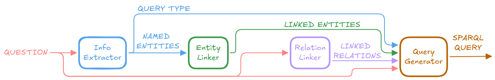

# DBLP-KGQA

[](https://github.com/gerba98/dblp-kgqa)

This repository contains the code for my Master's Thesis **"A Semantic Parsing Approach to Knowledge Graph Question Answering over DBLP using LLMs and RAG"**. 

I built an end-to-end Knowledge Graph Question Answering (KGQA) system over the [DBLP](https://dblp.org/) knowledge graph that translates natural language questions into SPARQL queries using Large Language Models (LLMs) and Retrieval-Augmented Generation (RAG).

<p align="center">
  
</p>

> [!NOTE]
> **For the architecture, methodology, and experimental results in detail, see my thesis** [**HERE**](doc/masters-thesis.pdf).

## Requirements

- Docker
- A Google API key (the free tier is sufficient). You can get one at https://aistudio.google.com/apikey (Google Cloud Vertex AI is also supported).
- [`uv`](https://docs.astral.sh/uv/getting-started/installation/) — only required on the host if you use Qwen as the LLM backend (`make llm-cpu` / `llm-gpu` / `runpod-*`).

## How to run the demo

The demo runs the KGQA pipeline step-by-step on any natural language question. It executes the generated queries against the live [DBLP SPARQL endpoint](https://sparql.dblp.org/) and uses the [DBLP search APIs](https://dblp.org/faq/13501473.html) for entity linking.

https://github.com/user-attachments/assets/1c6f7063-0c07-4cd7-9023-1a2db50e7610

### 1. Create `.env` from the template

```bash
cp .env.example .env
```

<details>
<summary><b>(Linux only) Match host UID/GID</b></summary>

To ensure files written by the container are owned by your host user, set the following variables (this is not needed on macOS or Windows since Docker Desktop remaps automatically):

```bash
echo "USER_UID=$(id -u)" >> .env
echo "USER_GID=$(id -g)" >> .env
```

</details>

### 2. Start the containers

This builds the `app` image and starts a Neo4j database.

```bash
docker compose up -d --build
```

### 3. Download the data

Fetches the `data/` folder containing the DBLP-QuAD dataset, the embeddings, and the DBLP ontology schema (~1 GB, one-time).

```bash
make init-data
```

### 4. Configure LLM backend

The pipeline requires an LLM and an embedding model.

#### **Google (Default)**  
By default, the pipeline uses Google for both the LLM (`gemini-3.1-flash-lite-preview`) and embeddings (`gemini-embedding-001`). Set `GOOGLE_API_KEY` in `.env` and you are done.

<details>
<summary><b>Use Vertex AI instead of an API Key</b></summary>

If you prefer Google Cloud ADC over an API key:
- set `GOOGLE_CLOUD_PROJECT` in `.env`
- add `use_vertexai: true` to `google_llm` and `google_embedding_*` in `config/services.yml`
- then run `make gcloud-auth`

</details>

<details>
<summary><b>Alternative LLM: Qwen</b></summary>

This setup uses `Qwen3.5-4B-UD-Q4_K_XL` for the LLM, which you can run either on your own machine or on a rented cloud GPU. 
> (Note: Google is still always required for the embedding models, so you must also configure the Google API key or Vertex AI as shown above).

**Option A: Local llama-server (your own GPU or CPU)**

It needs about **5 GB of VRAM** for full GPU offload; CPU mode works without a GPU but is much slower.

1. Start the server:

   ```bash
   make llm-gpu   # NVIDIA GPU (≥5 GB VRAM)
   # or
   make llm-cpu   # CPU only
   ```

   *(The first start downloads the model from Hugging Face into a Docker volume. Later starts reuse the cache.)*

2. If your GPU does not have enough VRAM for the full model, set `local_llm.backend.n_gpu_layers` in `config/services.yml` to a smaller integer (for example `30`). The remaining layers run on CPU.

3. Open `config/demo.yml` and replace every `llm_service_name: google_llm` with `llm_service_name: local_llm`.
4. Open `config/services.yml` and set `local_llm.backend.base_url` to `http://llama-server:8080`.
5. To stop the server when done:

   ```bash
   make llm-down
   ```

**Option B: RunPod (cloud GPU)**

1. Get an API key from https://runpod.io and set `RUNPOD_API_KEY` in `.env`.
2. Start a pod with the model defined in `config/services.yml` (`local_llm.backend.model_name`):

   ```bash
   make runpod-start
   ```

3. Get the public URL of the pod:

   ```bash
   make runpod-url
   ```

4. Open `config/demo.yml` and replace every `llm_service_name: google_llm` with `llm_service_name: local_llm`.
5. Open `config/services.yml` and set `local_llm.backend.base_url` to the URL from step 3.
6. When you are done, stop the pod:

   ```bash
   make runpod-stop
   ```

</details>

### 5. Run the demo

Start the Streamlit application:

```bash
make demo
```

Once it is running, open [http://localhost:8501](http://localhost:8501) in your browser.

> **Note**: The first time you open the application, it will take a few minutes to load. This is because Neo4j needs to be initialized in the background with the DBLP-QuAD training set, the DBLP ontology schema, and their corresponding embeddings.

<br>

## Dev Mode & Reproducing Experiments

Use this mode if you want to modify the project code or reproduce my experiments.

> **Note**: You can view the results, metrics, and logs of the experiments reported in my thesis in this [Google Drive folder](https://drive.google.com/drive/folders/12D05F9LTrDHFe9VK07th8MJ1q7guq4df?usp=drive_link).

### 1. Initial Setup
Create your environment file as in **Step 1 of the Demo section** (`cp .env.example .env`). On Linux, also apply the UID/GID fix from that step before starting the container. This is the only setting that must be in place at boot time. All other variables can be set later, and each `make` command picks up the latest values.

### 2. Enter the Development Container
All dependencies and tools are pre-configured in a Docker environment. You can access it in two ways:
- **VS Code (Recommended)**: You must have the **Dev Containers** extension installed. Open the repository folder in VS Code and click "Reopen in Container" when prompted.
- **CLI (Standalone)**: Start the dev container with `make dev-up`, then enter it using `docker compose exec -it app bash`.

*(When you are done, you can clean up the volumes for either method by running `make dev-down` in your host terminal).*

### 3. Download the data
Same as **Step 3 of the Demo section**:

```bash
make init-data
```

### 4. Configure LLM backend
Follow the same backend configuration steps from the **Demo** section.

> **Important**: If you swap the LLM backend to Qwen or Vertex AI, apply the configuration changes to `config/experiment.yml` instead of `config/demo.yml`.

### 5. Set up Virtuoso
The experiments require a local Virtuoso SPARQL endpoint loaded with a 2022 DBLP RDF dump, because the current public endpoint has changed since the DBLP-QuAD dataset was created. Set it up with:

```bash
make virtuoso-up
make virtuoso-init
```
The first command starts a Virtuoso container at `http://virtuoso:8890/sparql`. The second loads the DBLP RDF dump into it. Loading takes 30–60 minutes.
**Note**: `make virtuoso-init` creates a persistent volume. The next time you start the project, you only need to run `make virtuoso-up` and the data will already be there!

### 6. Configure the experiment
Open `config/experiment.yml` to set up the pipeline configuration you want to evaluate. 

If you want to reproduce the exact results reported in my thesis, you can find the complete configuration files (`experiment.yml` and `services.yml`) used for each run inside the Google Drive folder linked above. You can simply copy them over to your `config/` directory.

### 7. Run the experiment

```bash
make experiment
```
Note that the terminal log level is set to `WARNING`. During the run, the complete execution logs and the partial checkpoints (saved every 50 samples) can be found in the `experiment_output/current/` directory. Once the run completes, the evaluation metrics are calculated automatically, and all results are moved to `experiment_output/results/<timestamp>_<split>/`.

<br>

## Acknowledgments

My project builds upon resources, data, and ideas from the following open-source works:
- **[DBLP-QuAD](https://github.com/awalesushil/DBLP-QuAD)**
- **[Scholarly QALD Challenge](https://github.com/debayan/scholarly-QALD-challenge)**
- **[ASK-DBLP](https://github.com/semantic-systems/ask-dblp)**
- **[NLQxform](https://github.com/ruijie-wang-uzh/NLQxform)**
